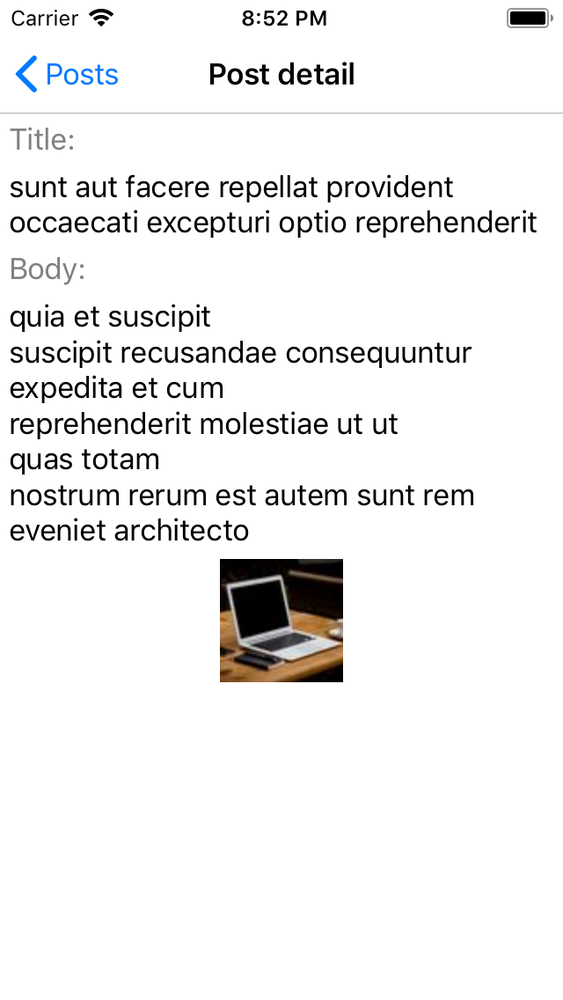
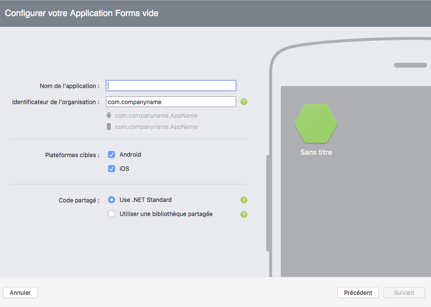
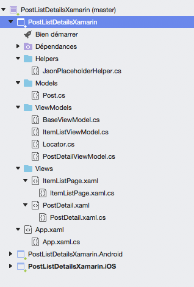

# Master detail navigation with Xamarin

In the previous guide, we developed a Xamarin that displays on a list data fetched from the internet. In this guide, we go further by showing a detail view when we tap on an item. We first create the new view without complying to mvmm. Then, we will try to organize the code with respect to the mvvm pattern. Let's begin.

## Adding the PostDetail page

Adding the detail page without considering MVVM is the easier and straightforward way. First, create the `PostDetailViewModel` class as well as the `PostDetail.xaml` page it's code-behind. The view model defines a property of type `Post` which is bound to the xaml view. The code-behind takes a parameter of type of type `Post`and passes it to the view model. Here is the code for each file:

PostDetailViewModel.cs

```cs
public class PostDetailViewModel : BaseViewModel
{
    private Post post;
    public Post Post
    {
        get => post;
        set => SetProperty(ref post, value);
    }

    public PostDetailViewModel(Post post)
    {
        this.Post = post;
    }
}
```

PostDetail.xaml

```xml
<?xml version="1.0" encoding="UTF-8"?>
<ContentPage xmlns="http://xamarin.com/schemas/2014/forms"
     xmlns:x="http://schemas.microsoft.com/winfx/2009/xaml"
     x:Class="PostListDetailsXamarin.Views.PostDetail" Title="Post detail">
    <ContentPage.Content>
        <StackLayout Orientation="Vertical" Padding="5,5,5,5">
            <Label TextColor="Gray">Title: </Label>
            <Label Text="{x:Binding Post.Title}" />
            <Label TextColor="Gray">Body: </Label>
            <Label Text="{x:Binding Post.Body}" />
            <Image Source="{x:Binding Post.ImageUrl}" WidthRequest="70"
                 HeightRequest="70" />
        </StackLayout>
    </ContentPage.Content>
</ContentPage>
```

PostDetail.xaml.cs

```cs
public partial class PostDetail : ContentPage
{
    PostDetailViewModel postDetailViewModel;

    public PostDetail()
    {
        InitializeComponent();
    }

    public PostDetail(Post post)
    {
        InitializeComponent();
        postDetailViewModel = new PostDetailViewModel(post);
        this.BindingContext = postDetailViewModel;
    }
}
```

In order to display this new view when the user taps the view, we will handle the onTap event of the `ListView`. Please add the `ItemSelected` attribute to the `ListView` in ItemListPage.xaml.

```xml
<ListView ItemsSource="{x:Binding Posts}"
        SelectedItem="{x:Binding SelectPost}"
        VerticalOptions="FillAndExpand" CachingStrategy="RecycleElement"
        ItemSelected="Handle_ItemSelected">
```

In this code snippet, the `Handle_ItemSelected` function handles the `ItemSelected` event. Here is the implementation of that function:

```cs
async void Handle_ItemSelected(object sender, Xamarin.Forms.SelectedItemChangedEventArgs e)
{
    var postDetailPage = new PostDetail(e.SelectedItem as Post);
    await Navigation.PushAsync(postDetailPage);
}
```

What we did here is that we ask the `Navigation` property of the `ContentPage` class to navigate to a new page. This new page is an instance of `PostDetail` class that takes the select post as a parameter.

Launch the app and tap on an item in the list. The detail page of that item should appear.



Here, we did it ..., or not. In fact, the code not really follow mvvm _principles_. Here are some of the **sins** of this code:

* The tap event is handled by the view instead of the view model through a command.
* Both the pages instantiate the view models instead of using an IoC container.

In the next section, We'll try to address these points.

## Handling the tap event using a command

A command is a mechanism that allows to handle events in the view model. It works by binding an event in the control to a command in the view model. In order for this to work we need two elements.

* The control must accepts a command property for the event that we want to handle
* The view model must provide a public command that handles the event
* The command in view model must be bound to the control

The second and third conditions are very easy to satisfy, because it is really to define a command and to bind it. However, there is one little gotcha. The ListView control does not accept natively a command property for the tapped event. Since we are not going to [buy a richer ListView control](https://www.telerik.com/purchase/xamarin-ui), we need to find another cue. Hopefully, there is a quite powerful technique in Xamarin that allows to exactly do that. It is called [**behaviors**](https://docs.microsoft.com/en-us/xamarin/xamarin-forms/app-fundamentals/behaviors/).

Behavrios are defined by MSDN as follows _"Behaviors lets you add functionality to user interface controls without having to subclass them. Behaviors are written in code and added to controls in XAML or code"_. That's exactly what we to do, which is invoke a command from the view model when the `SelectedItem` event is triggered. In order to add that behavior, we can follow the [MSDN guide](https://docs.microsoft.com/en-us/xamarin/xamarin-forms/app-fundamentals/behaviors/creating), or, since we are lazy programmers, we can use already defined ones.

Hopefully, some libraries are available on the internet. I recommend [Xamarin.Forms.BehaviorsPack](https://github.com/nuitsjp/Xamarin.Forms.BehaviorsPack) since it is the one that requires the least boilerplate code. Unfortunately, I had problems adding the NuGet packages of this library to my current projects. There were mainly two reasons. The first one is that the common project between iOS and Android is a PCL project instead of a .Net Standard 2.0 one. The second reason is that the XAML files fail to reference behavior classes defined in the library. After many tries, I ended-up replacing the PCL project with a .Net Standard project and using the source code of the library instead :scream:.

.Net Standard is a better way than PCL to share code between project and is the recommended way. In order to use .Net Standard 2.0 instead of PCL, we need to update to Visual Studio for Mac 7.5 and create a new project and copy all the xaml and cs files into the new project. Since version 7.5 was in beta at the time of writing, I had to switch to the **beta** option in the updates window. You can access it by clicking one Visual Studio Community menu -> updates.


After switching to beta update channel, some updates will popup. Install them and restart Visual Studio for Mac and you should be able to create Xamarin apps that use .Net Standard 2.0. Please go ahead and create a new empty Xamarin Forms project and **make sure** that that **.Net Standard** is selected.



Once the project is created, you can add the code that we already created by using the _Add->Add file_ or _Add-> Add files from folder_ or _Add->Add folder_. The project structure should be similar to the previous project that we created using a previous version of Visual Studio for Mac and that was using PCL.



Now, let's move on to adding the source code of [Xamarin.Forms.BehaviorsPack](https://github.com/nuitsjp/Xamarin.Forms.BehaviorsPack) to our project (as a reminder, I has to do that because I could not reference the NuGet library in xaml). Download and add to the .Net Standard project all the files in [this folder](https://github.com/nuitsjp/Xamarin.Forms.BehaviorsPack/tree/master/src/Xamarin.Forms.BehaviorsPack), except _Xamarin.Forms.BehaviorsPack.cs_ and _Xamarin.Forms.BehaviorsPack.csproj_. In my case, I put them in a folder named _Xamarin.Forms.BehaviorsPack_. The new project structure should look like this.


Yaay, we can finally add some fancy commands using behaviors. We will start by adding the behavior markup in the ItemListPage.xaml file. Two simple thinks need to be done here. First, in the content page tag, add an alias to the `Xamarin.Forms.BehaviorsPack` called `behaviorsPack` as follows.

```xml
<ContentPage xmlns="http://xamarin.com/schemas/2014/forms"
     xmlns:x="http://schemas.microsoft.com/winfx/2009/xaml"
     xmlns:behaviorsPack="clr-namespace:Xamarin.Forms.BehaviorsPack"
     xmlns:local="clr-namespace:PostListDetailsXamarin"
     x:Class="ItemsDetailXamarin.Views.ItemListPage" Title="Posts">
```

Second, link the behavior defined in `behaviorsPack:SelectedItemBehavior` to a command that we named `ItemSelectedCommand`. We will define it later in the view model.

```xml
<ListView ItemsSource="{x:Binding Posts}"
             SelectedItem="{x:Binding SelectPost}"
             VerticalOptions="FillAndExpand" CachingStrategy="RecycleElement"
             RefreshCommand="{x:Binding RehreshCommand}">
    <ListView.Behaviors>
        <!-- The behavior that allows to use a command for the SelectedItem event -->
        <behaviorsPack:SelectedItemBehavior Command="{Binding ItemSelectedCommand}" />
    </ListView.Behaviors>
    <ListView.ItemTemplate>
    <!-- item code-->
    </ListView.ItemTemplate>
</ListView>
```

Note that we have removed the ItemSelected event handler and replaced it with a `<ListView.Behaviors>` tag that uses the behavior defined in the class `SelectedItemBehavior` defined in the namespace `behaviorsPack` (which is an alias to `Xamarin.Forms.BehaviorsPack`).

That's all we need to in the xaml. Next, open the ItemListViewModel.cs file and define the `ItemSelectedCommand` property as follows.

```cs
//The command taks a Post as a parameter, because it is the type of the selected item
public ICommand ItemSelectedCommand => new Command<Post>((selectedItem) =>
{
    System.Diagnostics.Debug.WriteLine("Command invoked for item: " + selectedItem.Title);
});
```

This command basically prints a the title of the selected item in the console.

Everything is wired now, please run the app and tap on an item. Nothing should happen on the smartphone but you should see lines appear in the logs as you tab on the items.


Perfect, the code behind does not handle the tap event anymore and we have a cleaner mvvm pattern thanks to commands. We will tackle next the problem of navigating from the view model.

## Navigation from the view model

The following step consists in opening the detail view in the command. But, this is not possible because the view model does not have access to `Navigation` object because it is part of the page.

Install extensions

* MVVLlight
* mvvmlight.xamarinforms

## Links

[A simple Navigation Service for Xamarin.Forms](https://mallibone.com/post/a-simple-navigation-service-for-xamarinforms?mode=edit)

[Navigation using MVVM Light](https://wolfprogrammer.com/2016/07/22/navigation-using-mvvm-light/)

[Dependency injection with Autofac and MVVM Light in Xamarin](https://www.chipsncookies.com/2016/dependency-injection-with-autofac-and-mvvm-light-in-xamarin/)

[https://docs.microsoft.com/fr-fr/xamarin/xamarin-forms/app-fundamentals/navigation/hierarchical](https://docs.microsoft.com/fr-fr/xamarin/xamarin-forms/app-fundamentals/navigation/hierarchical)

[ServiceLocator & NETStandard.Library (2.0.0) - SimpleIoc.Default not valid](https://forums.xamarin.com/discussion/105733/servicelocator-netstandard-library-2-0-0-simpleioc-default-not-valid)

[Xamarin.Forms - InitializeComponent doesn't exist when creating a new page](https://stackoverflow.com/questions/28818525/xamarin-forms-initializecomponent-doesnt-exist-when-creating-a-new-page?utm_medium=organic&utm_source=google_rich_qa&utm_campaign=google_rich_qa)
