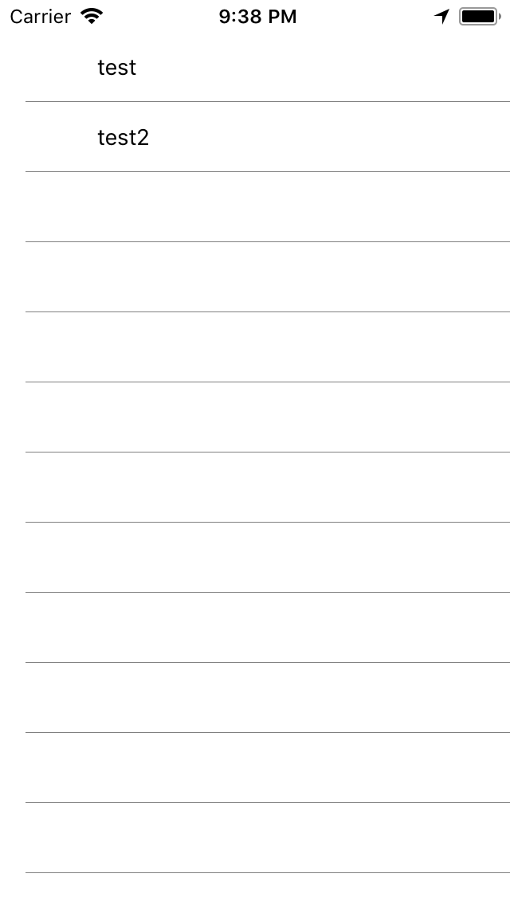
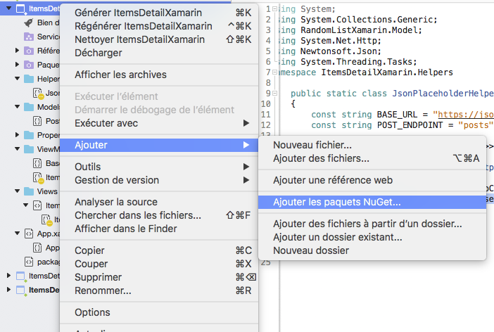
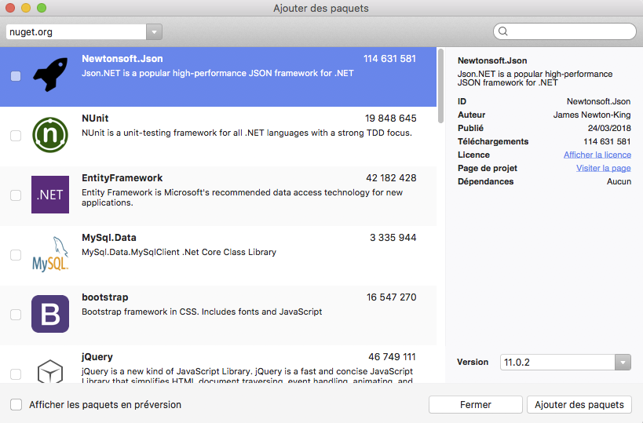
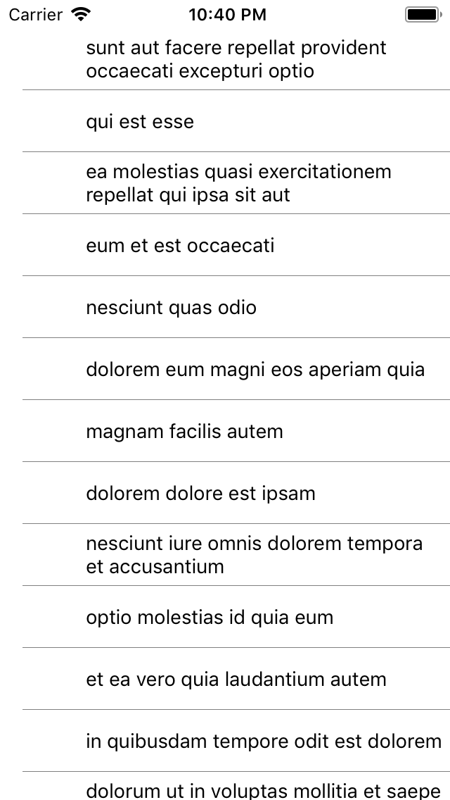
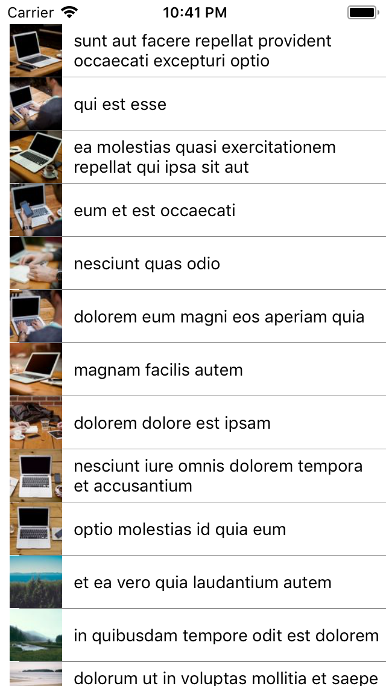

# Xamarin guide

This article will guide through the steps of creating a typical list / detail app using Xamarin Forms. The advantage of using Xamarin Forms is that we will obtain a native Android and iOS apps using a single C# / Xaml codebase.

I am using macOS and Visual Studio Community for macOS but you can also follow the guide using Visual Studio on windows.

Let's start by the beginning of all things; creating the project.

## Creating the project

Open Visual Studio and create a new Project -> Choose Blank App -> And the click . You will a minimal solution that contains three minimal projects (as usual for Xamarin projects :smile: )

As a reminder, we are creating a Xamarin forms app that fetches a list of items from the internet and shows in on a scrollable list. Each row of the list will display an item with some text content and a thumbnail.

We are not going to developer neither the JSON API nor the thumbnail server. Instead, we'll use a free JSON generator for developers [https://jsonplaceholder.typicode.com](https://jsonplaceholder.typicode.com/) and a free image generator [https://picsum.photos](https://picsum.photos/).

Before Starting to code, let's create some folders to organize our code. There will be 4 main folders: Views, ViewModels, Models and Helpers.

In the next section, we will create the main view.

## The ItemListView

The main view of this tutorial shows random posts from [jsonplaceholder post API](https://jsonplaceholder.typicode.com/posts) and associates each one with a random thumbnail downloaded from [picsum.photos](https://picsum.photos/). In this section, we are just going to create the model, the view and its view model. So, let's start.

Firstly, in the Models folder, create a new class called `Posts.cs` which represents a single post. Add the following properties: `Title`, `UserId`, `Id`, `Body`, `ÌmageUrl`. The first four variables are mapped from the [jsonplaceholder post API](https://jsonplaceholder.typicode.com/posts) while the `ImageUrl` is generated randomly as we will see later.

The posts class should look like this:

```cs
namespace RandomListXamarin.Model
{
    public class Post
    {
        public string Title { get; set; }
        public int UserId { get; set; }
        public int Id { get; set; }
        public string Body { get; set; }
        public string ImageUrl { get; set; }
    }
}
```

Secondly, create the view model class `ItemListViewModel`. It defines the Posts property that stores the current list of posts. It also inherits from a class called `BaseViewModel`. It is usual in MVVM to have this kind of base class to simplify binding. Here is its definition that you just need to copy.

```cs
namespace RandomListXamarin.ViewModels
{
    public class BaseViewModel : INotifyPropertyChanged
    {

        protected bool SetProperty<T>(ref T backingStore, T value,
            [CallerMemberName]string propertyName = "",
            Action onChanged = null)
        {
            if (EqualityComparer<T>.Default.Equals(backingStore, value))
                return false;

            backingStore = value;
            onChanged?.Invoke();
            OnPropertyChanged(propertyName);
            return true;
        }

        #region INotifyPropertyChanged
        public event PropertyChangedEventHandler PropertyChanged;
        protected void OnPropertyChanged([CallerMemberName] string propertyName = "")
        {
            var changed = PropertyChanged;
            if (changed == null)
                return;

            changed.Invoke(this, new PropertyChangedEventArgs(propertyName));
        }
        #endregion
    }
}
```

The ItemListViewModel class should look like this.

```cs
namespace RandomListXamarin.ViewModels
{
    public class ItemListViewModel : BaseViewModel
    {
        public ObservableCollection<Post> Posts { get; set; }

        public ItemListViewModel()
        {
            this.Posts = new ObservableCollection<Post>();
            //Just for tesing
            this.Posts.Add(new Post
            {
                Title = "test"
            });
            this.Posts.Add(new Post
            {
                Title = "test2"
            });
        }
    }
}
```

Note that in the constructor, we add two hard coded posts for the purpose of testing that the binding to the view works. We will replace it later with the content fetched from the API :smile:.

The third and last step in this section is to create the view that shows the Posts of our view model. In the views folder create a **Content Page XAML form** by right clicking on the view folder, then by choosing Add -> New file -> **Content Page XAML form**. You can name it *ItemListPage.xaml*.

After that, Open the code behind file *ItemListPage.xaml.cs*. There, define an item ItemListViewModel variable instance and set it as a `BindingContext` in the constructor. The `BindingContext` tells Xamarin which object is used for the binding in the XAML. The code behind should resemble to the following code:

```cs
namespace ItemsDetailXamarin.Views
{
    public partial class ItemListPage : ContentPage
    {
        ItemListViewModel itemListViewModel;

        public ItemListPage()
        {
            InitializeComponent();
            itemListViewModel = new ItemListViewModel();
            BindingContext = itemListViewModel;
        }
    }
}
```

Next, open the *XAML* file where we create a `ListView` control that binds to the `Posts` property of the `BindingContext` (which is an instance of `ItemListViewModel`). The visual representation of each item of the list can be defined using `ListViewItem.ItemTemplate` tag. The very interesing thing is that inside this tag, we are automagically bound to a the current `Post` instance. For example, this snippet shows the titles of the posts.

```xml
<ListView ItemsSource="{Binding Posts}">
    <ListView.ItemTemplate>
        <DataTemplate>
            <ViewCell>
                <Label Text="{Binding Title}" VerticalTextAlignment="Center" FontSize="Small" />
            </ViewCell>
        </DataTemplate>
    </ListView.ItemTemplate>
</ListView>
```

The final XAML file defines is more interesting because it shows also the an image which is bound to the `ImageUrl`. Here is the full content of the XAML file

```xml
<?xml version="1.0" encoding="UTF-8"?>
<ContentPage xmlns="http://xamarin.com/schemas/2014/forms" xmlns:x="http://schemas.microsoft.com/winfx/2009/xaml" x:Class="ItemsDetailXamarin.Views.ItemListPage">
    <ContentPage.Content>
        <ListView ItemsSource="{Binding Posts}" VerticalOptions="FillAndExpand" CachingStrategy="RecycleElement">
            <ListView.ItemTemplate>
                <DataTemplate>
                    <ViewCell>
                        <StackLayout Padding="5,0,5,0" HorizontalOptions="StartAndExpand" Orientation="Horizontal">
                            <Image Source="{Binding ImageUrl}" WidthRequest="50" HeightRequest="50"  />
                            <Label Text="{Binding Title}" VerticalTextAlignment="Center" FontSize="Small" />
                        </StackLayout>
                    </ViewCell>
                </DataTemplate>
            </ListView.ItemTemplate>
        </ListView>
    </ContentPage.Content>
</ContentPage>
```

Finally, in the `App.xaml.cs`'s constructor, set the `MailPage` to an instance of `ItemListPage` as follows.

```cs
public App()
{
    InitializeComponent();

    MainPage = new ItemListPage();
}
```

Run the app on iOS or Android, you should see a similar screen to this screenshot:



In the next section, we will download the posts from the internet and display them on the list as soon as they are available :muscle:.

## Fetching JSON from the internet

Downloading JSON files and parsing in Xamarin is very easy thanks to .Net Standard. In fact, downloading data using `HttpClient` and parsing it using `Newtonsoft.Json` requires a little bit code.

As a proof, here is the snippet that downloads the posts from the API:

```cs
const string BASE_URL = "https://jsonplaceholder.typicode.com/";
const string POST_ENDPOINT = "posts";
using (var httpClient = new HttpClient())
    {
        var jsonString = await httpClient.GetStringAsync(BASE_URL + POST_ENDPOINT);
    }
}
```

Parsing is also straight forward after annotating the `Post`class:

```cs
var posts = JsonConvert.DeserializeObject<List<Post>>(jsonString);
return posts;
```

Now that you are convinced :stuck_out_tongue_winking_eye:, let's implement that.

First of all, add the `Newtonsoft.Json` library to the project using NuGet. Right-click on the common project and choose Add -> Add NuGet package



Look `Newtonsoft.Json` for and add it.



We can now fully implement our logic. Continue by adding somme attributes to the properties of the `Posts` class. They allow to tell the Json parser how to map each Json property with the properties of the post class. To better understand, let's look at a snippet of the Json received by calling [https://jsonplaceholder.typicode.com/posts](https://jsonplaceholder.typicode.com/posts).

```json
[
  {
    "userId": 1,
    "id": 1,
    "title": "sunt aut facere repellat provident occaecati excepturi optio reprehenderit",
    "body": "quia et suscipit\nsuscipit recusandae consequuntur expedita et cum\nreprehenderit molestiae ut ut quas totam\nnostrum rerum est autem sunt rem eveniet architecto"
  },
  //other posts
]
```

Here, we want to map `userId` field of the Json with the `UserId` field of the Posts class and so on. We do this by putting `[JsonProperty("userId")]` before the `UserId`property definition.

Here is the updated `Posts` class with all the annotations:

```cs
using Newtonsoft.Json;

namespace RandomListXamarin.Model
{
    public class Post
    {
        [JsonProperty("title")]
        public string Title { get; set; }

        [JsonProperty("userId")]
        public int UserId { get; set; }

        [JsonProperty("id")]
        public int Id { get; set; }

        [JsonProperty("body")]
        public string Body { get; set; }

        public string ImageUrl { get; set; }
    }
}
```

No surprise here. Note that we didn't map the ImageUrl property because we are going set there a different value later. The next step consists of downloading and parsing the Json file.

If you remember, I already showed how to download a Json file and also how to parse it. Let's put that together in a `GetPostsAsync` method. Since this is more of a helper method, please define it in the `JsonPlaceholderHelper` static class and place it inside the **Helpers** folder. That's some clean organization :file_folder:.

Here is the content of the `JsonPlaceholderHelper` class:

```cs
using System.Collections.Generic;
using RandomListXamarin.Model;
using System.Net.Http;
using Newtonsoft.Json;
using System.Threading.Tasks;
namespace ItemsDetailXamarin.Helpers
{
    public static class JsonPlaceholderHelper
    {
        const string BASE_URL = "https://jsonplaceholder.typicode.com/";
        const string POST_ENDPOINT = "posts";

        public static async Task<List<Post>> GetPostsAsync()
        {
            using (var httpClient = new HttpClient())
            {
                var jsonString = await httpClient.GetStringAsync(BASE_URL + POST_ENDPOINT);
                var posts = JsonConvert.DeserializeObject<List<Post>>(jsonString);
                return posts;
            }
        }
    }
}
```

There are two more things to do before getting the posts displayed. The first one consists in adding a method the in the view model which calls the helper method and adds the returned posts to the `Posts` collection. Please add this method to the `ItemListViewModel`

```cs
public async Task UpdatePostsAsync()
{
    var newPosts = await JsonPlaceholderHelper.GetPostsAsync();
    this.Posts.Clear();
    newPosts.ForEach((post) =>
    {
        this.Posts.Add(post);
    });
}
```

The last thing is to call this function from the view. There are many ways to de it. One solution is to override the `OnAppearing` method because it is automatically called when just before the view appears. Again, please add this code to *ItemListPage.xaml.cs*'s `ItemListPage` class.

```cs
protected override async void OnAppearing()
{
    base.OnAppearing();
    await itemListViewModel.UpdatePostsAsync();
}
```

Launch the app again. Wow it works :sparkler:. However, there are not thumbnails for now. The next section deals with that.



## Displaying thumbnails

Here again, showing thumbnails is very easy. Since the ImageUrl property is already bound in the view, we just need to set in ImageUrl and that's it. Xamarin automatically, downloads the images and as a bonus, caches it for us.

In this guide, we are going to download images from [picsum.photos](https://picsum.photos/), particularly this type of url: [https://picsum.photos/70/?image={an integer value}](https://picsum.photos/70/?image=[an integer value) where the integer value corresponds the index of the post in the list. For example the thumbnail url of the post at index 57 is [https://picsum.photos/70/?image=58](https://picsum.photos/70/?image=58). In code, update the `UpdatePostsAsync` method as follows:

```cs
public async Task UpdatePostsAsync()
{
    var newPosts = await JsonPlaceholderHelper.GetPostsAsync();
    this.Posts.Clear();
    newPosts.ForEach((post) =>
    {
        post.ImageUrl = "https://picsum.photos/70/?image=" + newPosts.IndexOf(post);
        this.Posts.Add(post);
    });
}
```

The trick is to set the image url before adding it to the Posts collection.

If you run the app, the thumbnails should be shown progressively.



It's conclusion time for this guide.

## Conclusion and going further

This guide showed how to create a Xamarin app that downloads a Json array, parses it and shows it on a list along with thumbnails. Thanks to the Xamarin SDK and .Net Standard, we did not write a lot of code and we can run this app on iOS and Android.

Further improvements can be implemented. For example, the list of posts can be persisted for offline use. Also, we can display a placeholder for thumbnails using the [FFImageLoading library](https://github.com/luberda-molinet/FFImageLoading).

I hope you liked working with Xamarin as much as myself :).

The project source is on [GitHub](https://github.com/yostane/xamarin_guide/tree/master/ItemsDetailXamarin). Happy coding.

## Links

- [https://jsonplaceholder.typicode.com](https://jsonplaceholder.typicode.com/)
- [https://picsum.photos](https://picsum.photos/).
- [FFImageLoading library](https://github.com/luberda-molinet/FFImageLoading)
- [Microsoft Docs](https://docs.microsoft.com/en-us/xamarin/xamarin-forms/user-interface/images?tabs=vswin)
